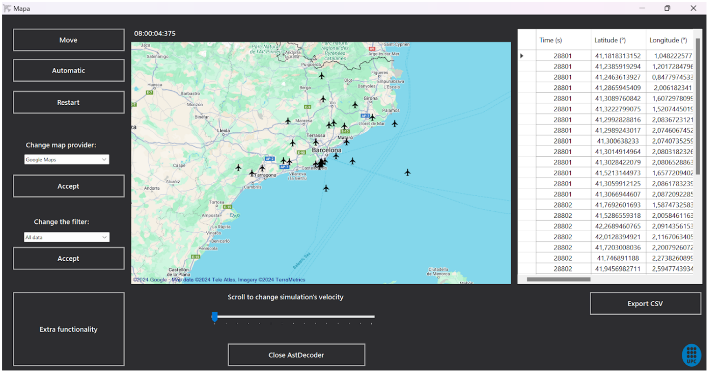
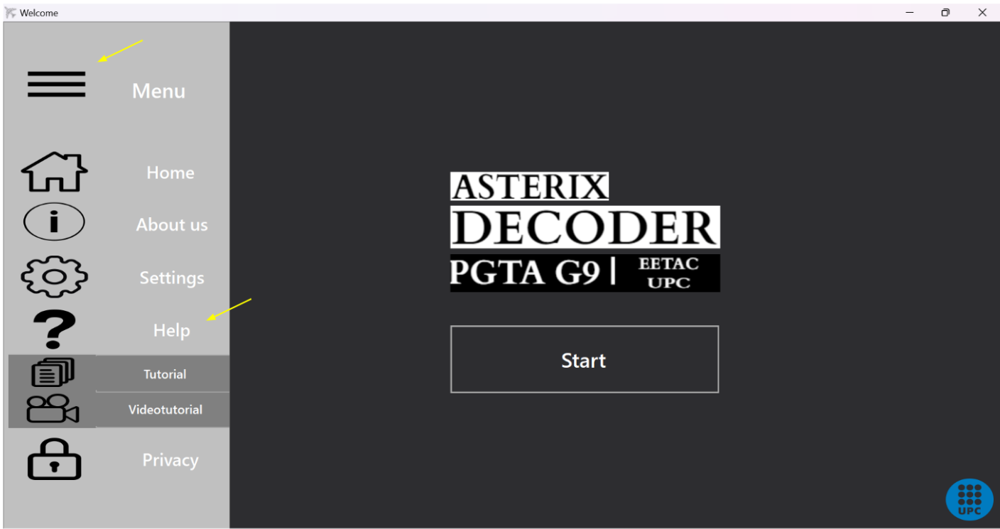
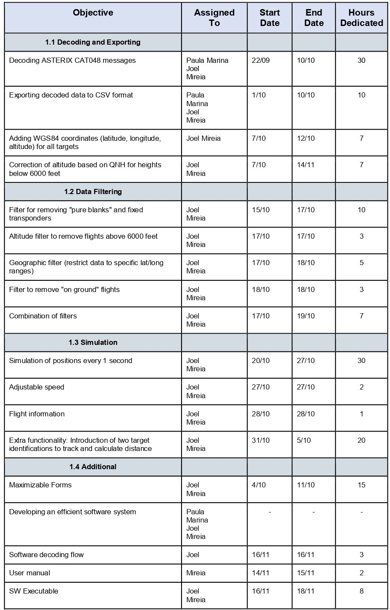

# ASTERIX CAT048 DECODER
This document explains the functionality of the ASTERIX CAT048 Decoder software, its main features, and how the different parts of the code are integrated to process, visualize, and export air traffic data.

<em>Group members: Alejandro Curiel Molina, Marina Martín Ferrer, Jose Carlos Martínez Conde, Joel Moreno de Toro, Èrica Parra Moya, Paula Valle Bové, Mireia Viladot Saló</em>.

## 1. General Description of the Software
The ASTERIX CAT048 Decoder is an application developed in C# to decode ASTERIX data from category 048. The software enables:
### 1.1 Decoding and Exporting
- Decoding ASTERIX CAT048 messages.
- Altitude correction based on QNH for altitudes below 6000 feet, applying standard atmospheric pressure.
- Exporting decoded data to CSV format.
### 1.2 Data Filtering
- Application of data filters and combinations of them.
    - Filter to remove "pure blanks" and fixed transponders.
    - Geographic filter to restrict data to specific latitude and longitude ranges.
    - Altitude filter to eliminate flights above 6000 feet.
    - Filter to remove "on ground" flights.
### 1.3 Simulation
- Real-time visualization of trajectories on a map.
- Simulation of positions at 1-second intervals.
- Real-time adjustment of simulation speed.
- Map provider change.
- Modification of the data filter during simulation.
- **Extra functionality:** Allows the input of two target identifications to simultaneously display the trajectories of two planes and calculate the distance between them on each antenna rotation.

## 2. Installation
### 2.1 Prerequisites
- [.NET 6 SDK](https://dotnet.microsoft.com/es-es/download/dotnet/6.0) or higher.
- Clone this repository and open it in a C# compatible development environment (e.g., Visual Studio or Visual Studio Code).
### 2.2 Cloning the repository

```bash
git clone https://github.com/Joowww/Proyecto2_PGTA.git
cd Proyecto2_PGTA
```
### 2.3 Dependencies
The main dependencies of this project are:
- **Accord** (Version 3.8.0): Library for image processing, machine learning, statistical analysis, etc.
- **Accord.Math** (Version 3.8.0): Extension of Accord.NET for mathematical operations.
- **VisioForge.DotNet.Core.Redist.Base.x64** (Version 15.10.22): Library for video and multimedia manipulation.
- **Zen.Barcode.Rendering.Framework** (Version 3.1.10729.1): Library for generating barcodes in .NET.

This project uses NuGet to manage dependencies. After cloning the repository, make sure to restore all necessary dependencies by running the following command in the terminal or command line from the project folder:
```bash
dotnet restore
```
## 3. User Manual and Usage Guide
**1. Welcome Menu**: The welcome menu includes a dropdown with several buttons. There is an “About Us” button that displays the names of the group members as well as their institutional email addresses. Next, there is a “Settings” button. Clicking this button allows you to customize the appearance of the application. You can switch the form’s theme between dark mode and light mode. Finally, there is the “Help” button, which is mentioned at the end of the manual. [click](#end)


**2. Import the Asterix file**: Once you click "Start" on the welcome menu, you need to import an Asterix file. It only allows importing files with the .ast extension. You have two options to do this:

&nbsp;&nbsp;&nbsp;&nbsp; I. Select a predefined file: You can choose one of the two Asterix files provided within the application.

&nbsp;&nbsp;&nbsp;&nbsp; II. Import your own file: If you prefer, you can also select and upload an .ast file from your computer.

<p align="center">
  
</p>

**3. Main Menu**: The dropdown menu allows you to return to the welcome menu using the "Home" button, so you can select a file again. It also gives you access to the "Help" and "Settings" functionalities.

<p align="center">
  
</p>

On this screen, you must also choose the type of filtering (or choose not to filter and simulate with all the data).

<p align="center">
  
</p>

The different types of filters you will encounter are:
- **Filter to remove "pure blanks"**: This filter works by checking the Type of the Target Report in Data Item 020 and removing messages that are not “Mode S Roll-Call” or “Mode S Roll Call + PSR.” In summary, only messages originating from Mode S interrogations or Mode S interrogations reinforced with primary interrogation are kept.
- **Filter to remove fixed transponders**: Fixed transponders are identified as those with the code “7777” in Mode-3/A. This filter is applied by accessing the Mode-3/A code from Data Item 070 and removing any messages where the code is “7777.”
- **Geographic filter to restrict data to specific latitude and longitude ranges**: This filter sets specific latitude and longitude limits, displaying only messages that fall within these boundaries.
- **Altitude filter to eliminate flights above 6000 feet**: This filter compares the altitude (corrected with QNH) to 6000 feet. If the altitude is above this threshold, the message is removed.
- **Filter to remove "on ground" flights**: Data Item 230 provides the Flight Status, which indicates whether the aircraft is “on ground.”

<em>NOTE: In this step, no matter what you choose, the planes with a Target Address set to "null" will be removed</em>.

**4. Simulation**: This interface allows you to visualize the flight simulation on a map, with the option to change the map provider according to your preferences. You can activate automatic mode to run the simulation continuously, adjusting the speed with the scroll wheel, or manually move the flights step by step every second using the "Move" button. You also have the option to restart the simulation with "Restart," apply different filters, and export the data in CSV format.

<p align="center">
  
</p>

<em>NOTE: The simulation shows the corrected altitude (altitude relative to sea level adjusted with the QNH, when applicable)</em>.

**5. Extra functionality**: When you press the "Extra functionality" button on the map interface, a tab will open with a brief explanation of the functionality, followed by a form to enter the necessary data.


<a id="end"></a>
In addition to this user guide, the software includes an option to access a video tutorial that explains how to use the main functionalities.

- **Acces to the video**: In the application interface, you will find a dropdown menu, within which there is a "Help" button where you can access a summarized tutorial of the main functionalities or the mentioned video tutorial.

<p align="center">
  
</p>

<em>NOTE: Make sure you have internet access to view the video tutorial, as it is streamed from an online source (YouTube)</em>.

## 4. Software Decoding Flow
The flowchart outlines the process of reading and decoding an AST file containing structured binary data. It starts by opening the file, setting up a binary reader, and defining key variables like FSPEC and Data Items. The data is then processed based on its length (fixed, variable, or repetitive), ensuring flexible handling. Error-handling mechanisms are also included to ensure system robustness. This flowchart provides a clear and structured view for efficiently interpreting AST files.


## 5. Project Planning
We began this project with four group members: Marina Martín Ferrer, Joel Moreno de Toro, Paula Valle Bové, and Mireia Viladot Saló. Once we completed the ASTERIX decoding and CSV export, we divided the work. Two members continued with this project (Joel and Mireia), while the other two started Project 3.

The table below shows the objectives, who completed them, as well as the dates and hours dedicated.

<p align="center">
  
</p>

## 6. ASTERIX Executable

